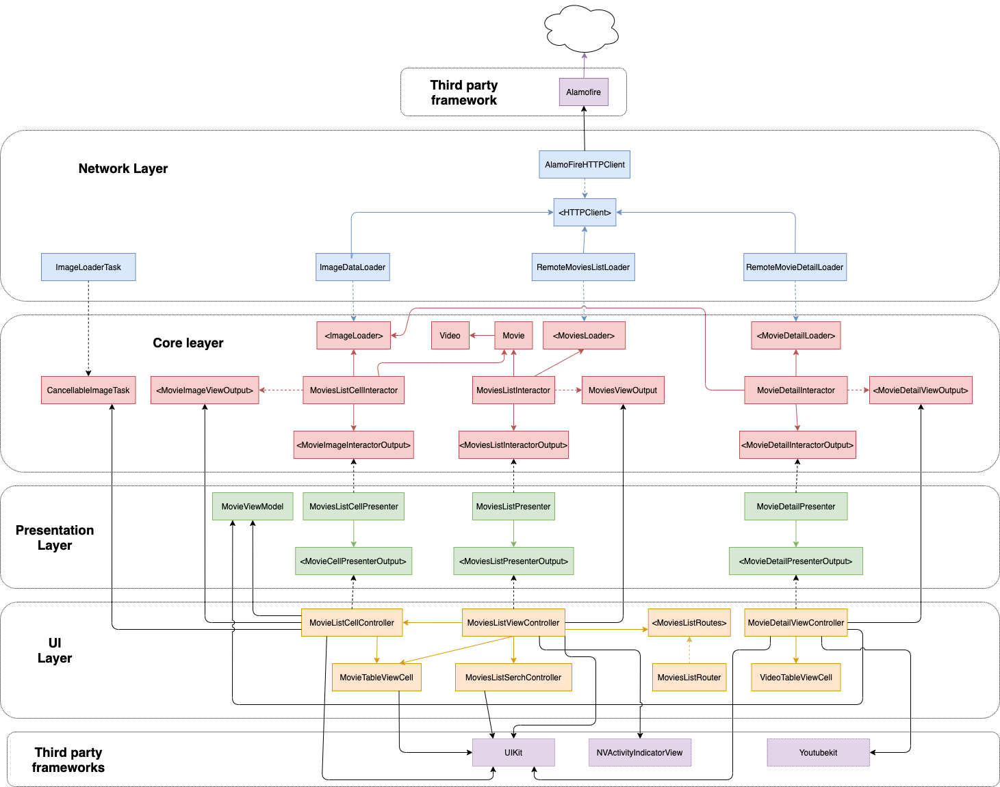

# TheMovieDatabaseSearch

## Description
### Movie database searcher. Displays list of movies obtained from [The Movie Database](https://www.themoviedb.org/?language=en-US). movies can be filtered by inserting text, or tapping on default filters. Tapping on a movie navigates to its detail where info is displayed and trailer videos can be streamed.

## Arquitecture 
### VIPER



## Dependencies
- Alamofire
- NVActivityIndicatorView
- YoutubeKit

## Installation
- clone project
- Open terminal and got to project's folder
- type 
```
pod install (downloads dependencies and creates workspace file)
```
- open TMDB.workspace file from Xcode
- run app


